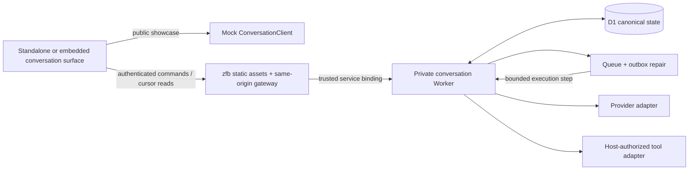

# 02 · Architecture and invariants

## Recommended topology



The diagram shows two mutually exclusive client modes, not a browser choosing freely between fake and live endpoints. Build the public showcase against the mock client. The non-public live frontend has a same-origin gateway and a private Worker service binding. zfb builds the static shell, components, and recipe content; no SSR adapter is needed merely to serve a static shell plus an independently authored gateway. Verify the actual build output against pinned zfb **3.0.0**. The renderer is bundled zudo-react; authored CSS uses `wind: false`. No independent React/Preact render root or SSR adapter is part of this baseline.

The v3 island pipeline emits one shared island bundle for a project. Consequently, different mock/live pages in one source graph are not a code-isolation boundary. Keep `apps/showcase` mock-only, and use a separate app/build graph for any private HTTP-client host. Do not statically import live adapters into public showcase roots and rely on a URL flag to disable them. No browser graph may contain credentials. This does not replace server authorization. Source: [tagged islands guide](https://github.com/Takazudo/zudo-front-builder/blob/v3.0.0/docs/src/content/docs/concepts/islands.mdx).

The gateway resolves the authenticated host principal and calls an internal service entrypoint. It never forwards client-supplied actor/scope headers as authority. The backend has no public route; `workers_dev` and preview exposure are off for that runtime. Service isolation is not user authorization: scoped ownership/permissions must still be checked at every operation. A named Worker entrypoint or tightly scoped private fetch dispatcher can carry validated internal commands; choose one and prove its binding in a two-Worker local test.

The scope key represents tenant + application + workspace. Conversations default to creator-private within that scope; shared visibility is a later host policy. Skills are workspace resources with distinct read/write permission. Do not infer authorization from a URL slug, random conversation ID, or the existence of a cache entry.

## Why not start with an agent framework?

Cloudflare's Agents SDK is a legitimate alternative and explicitly offers durable agent state, chat, and execution capabilities. It is not being rejected as incapable. This particular recipe needs provider-neutral history browsing, versioned skills, host-authored permissions, and a mockable API more than framework-specific agent behavior. A small D1 domain plus bounded queue steps makes those decisions explicit and keeps listing/history in one storage model. Source: [Cloudflare Agents](https://developers.cloudflare.com/agents/).

A future Durable Object/Agents adapter becomes attractive for long-lived bidirectional collaboration, per-conversation coordination, or framework-native execution. Adopt it only with a migration plan for conversation identity, listing, replay, retention, and the existing contract tests. Do not run independent authoritative copies in D1 and a Durable Object without a defined owner and repair process.

The sibling references reinforce these seams but have different constraints: pattern-gen owns short-lived Composer capabilities, zudo-text delegates to Flue, and zmod-bot uses durable D1 jobs. None is a drop-in general-purpose conversation history implementation. See the source audit.

## State and execution

Use the proposed `RunStatus` union in `contracts/domain.ts`:

```text
queued → running → awaiting_approval → applying → completed
             └───────────────────────────────→ completed (read-only)
             ├→ failed
             └→ cancel_requested → cancelled
awaiting_approval → completed (rejected)
awaiting_approval → conflicted (base no longer valid)
applying → needs_reconciliation → completed | failed | conflicted
```

The exact transition validator belongs in core. No terminal run is reset to running. Retry creates a new run with `retryOfRunId`, the same input message, and the same retained context snapshot. Refreshing a stale proposal creates a new run with `refreshOfProposalId`, fresh host reads/context, and a new immutable proposal. It is not a generation retry.

Only one nonterminal run is admitted per conversation, including pending review, cancellation requested, and reconciliation. This is an intentional first-release simplification. Users may switch conversations while a run progresses; multiple conversations may each have work, bounded by per-actor/workspace quotas.

### Accept first, execute second

A request transaction writes the scoped idempotency receipt, user message, exact selected context/skill pins, queued run, associated events, and outbox intent. Return `202` only after commit. A duplicate request key and identical normalized payload returns the original acceptance; the same key with different payload is a `409`.

Dispatch the outbox to a queue. Queue publication cannot be made atomically part of a D1 transaction, so a scheduled repair pass must retry committed unsent intents. Publication followed by a lost receipt may publish again. Cloudflare Queues has at-least-once delivery, so both claim logic and host effect receipts must tolerate duplicates. Source: [delivery guarantees](https://developers.cloudflare.com/queues/reference/delivery-guarantees/).

An immediate enqueue or `waitUntil` can reduce latency, but is not the sole durable path. Cloudflare documents a bounded post-request `waitUntil` lifetime; it is not a replacement for retained jobs. Source: [Worker execution context](https://developers.cloudflare.com/workers/runtime-apis/context/).

Each consumer claims one bounded step with a random claim token, generation counter, lease expiry, and attempt limit. Every state/event/checkpoint write includes the current claim fence. An expired worker must be unable to commit output after a successor claims the run. A timed-out model may be invoked twice during recovery; idempotent visible writes do not guarantee zero duplicate provider billing. Record this distinction instead of promising exactly-once inference.

### Event delivery

Persist checkpoints before exposing them. The proposed event protocol uses full entity upserts and monotonic per-conversation sequence numbers rather than raw token deltas. A text checkpoint replaces the current message parts; replaying it cannot append the same text twice. `contracts/event-projector.ts` demonstrates duplicate suppression and gap rejection.

Initial live transport: cursor polling while a run is active, with slower polling when idle and immediate catch-up after visibility/network resume. Proposed tunable starting points—not measured platform requirements—are roughly one second active polling, up to 15 seconds idle, jittered exponential reconnect backoff, and text checkpoints every 250–500ms subject to size/rate caps. Benchmark before committing those settings.

A snapshot must include a cursor for the **same consistent database cut** as its entities. Poll strictly after that cursor. Page cursors refer to the last returned event, never jump to the server's latest if more pages remain. A gap, unsupported schema, or expired replay window requires a fresh snapshot. SSE/WebSocket can replace the delivery channel later, but not the durable event store.

## Reviewed effects

A proposal contains exact normalized tool arguments, tool version, host resource identity, expected base revision (or expected absence), and a hash of those values. Its display payload must correspond to the action actually executed. The UI may show an excerpt initially, but must expose the complete change before approval.

Approval validates actor permissions, conversation/run/proposal relationship, pending status, and exact payload hash. Persist the decision and an execution intent. Then the host adapter **atomically** checks the resource revision and applies the change under a stable effect key. A separate “read current version” call followed by an unconditional write is not sufficient.

After a stale base, nothing is applied and the old proposal cannot become valid merely by changing its base metadata. A new proposal must be prepared and reviewed. Rejection creates a terminal outcome with no effect. A skill edit does not modify a pending proposal or its run snapshot.

A recipe database transaction cannot guarantee exactly-once effects in an arbitrary external CMS. Enable a write tool only when the host supports idempotent apply + effect lookup/reconciliation, or an equivalent transactional facility. A timeout after an external effect may have succeeded is `needs_reconciliation`; it is neither automatic failure nor permission to retry. Recheck authority for queued apply work, not only when approval was first submitted. Cancellation after a completed effect is not undo.

## Storage and caches

| Concern | Authority / policy |
| --- | --- |
| Conversation and visible messages | D1, scoped and paginated |
| Run status, event checkpoints, proposals, receipts | D1; commit before delivery |
| Skills and resolved versions | D1 immutable text revisions; restore appends |
| Accepted context | Immutable D1 manifest/snapshot, no credentials |
| Unsent draft | Browser-local UI state; not accepted server data |
| Large attachments | Deferred; no R2 requirement in v1 |
| Immutable derived context cache | Optional, content-addressed, disposable |
| Provider prompt cache | Provider-specific telemetry; unknown unless reported |

KV is eventually consistent and is not appropriate for mutable conversation heads, locks, approvals, or permission truth. A miss or stale negative cache entry must not affect correctness. Immutable cached skill/context blobs should be keyed by scope + exact version/content hash and validated before use. Read authoritative heads and permissions from primary storage. Source: [how KV works](https://developers.cloudflare.com/kv/concepts/how-kv-works/).

Begin without D1 read replication. Read authorization, snapshots, and mutation results from the primary; add session/bookmark behavior deliberately if replication is introduced. D1 batches are transactional, but a conditional update affecting zero rows is not a SQL failure. The candidate assertion pattern in `schema/schema-notes.md` turns failed predicates into an actual transaction abort. Source: [D1 database API](https://developers.cloudflare.com/d1/worker-api/d1-database/).

## Context and skill policy

An accepted context manifest includes input message IDs and their ordering boundary, exact skill IDs/versions/hashes, host facts/revisions used, assistant policy version, provider/model parameters, tool-registry version, summary coverage, and a canonical manifest hash. It contains no bearer tokens, session cookies, provider keys, or hidden model reasoning. Large or invalid context is rejected before accepting unbounded work.

Keep history and context separate. Summaries are derived artifacts with an explicit `throughEventSeq` boundary and can be regenerated from retained history; they must not overwrite it. Do not cache an entire action-producing run as if it were a read-only answer. Two requests that share a prompt fragment may still need different permission checks and host revisions.

Skills are UTF-8 text instructions. Keep executable tool schemas/implementations and permission policy outside them. Reuse History Stash's append/CAS/restore semantics; do not pull in its React viewer or binary multipart subsystem for a text-only first recipe. Its README also states that packages were not published at inspection time; verify package distribution before adding a dependency. Source: [History Stash README](https://github.com/Takazudo/zudo-history-stash/blob/main/README.md).

## Safety and operations gates

Default tools are read-only unless explicitly declared review-required. Bound message bytes, context bytes, generated output, model steps, tool calls, attempts, and concurrent runs. Treat retrieved page text and model/tool results as untrusted data. Never execute tool names/arguments simply because a model emitted them; validate against the host registry and principal.

Use safe Markdown rendering with raw HTML disabled/sanitized and a safe URL protocol allowlist. Do not log full prompts or response bodies by default. Exports are authenticated, scoped, and intentionally requested. Public mocks contain only synthetic fixtures.

Before live use, record an explicit retention window, quota policy, event-compaction/replay window, backup policy, and deletion limitations. Do not choose “retain forever” merely because the prototype has no delete button. Ordinary archive does not delete. Reconciliation and pending effects must not be purged by a generic retention sweep. Keep the live kill switch server-side and fail closed.
